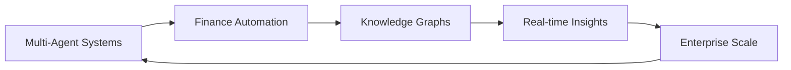

<picture>
  <source media="(prefers-color-scheme: dark)" srcset="https://raw.githubusercontent.com/Vrajesh-Babu/Vrajesh-Babu/output/github-snake-dark.svg" />
  <source media="(prefers-color-scheme: light)" srcset="https://raw.githubusercontent.com/Vrajesh-Babu/Vrajesh-Babu/output/github-snake.svg" />
  
</picture>

<div align="center">

# Vrajesh Babu A V

### AI/LLM Engineer | Finance Copilot Architect | Cloud-Native Builder

[](https://www.linkedin.com/in/vrajesh-babu-a-v/)
[](https://github.com/Vrajesh-Babu)

</div>

---

```
       ___           ___           ___           ___           ___           ___           ___
      /\  \         /\  \         /\  \         /\  \         /\__\         /\  \         /\  \
     /::\  \       /::\  \       /::\  \       /::\  \       /::|  |       /::\  \       /::\  \
    /:/\:\  \     /:/\:\  \     /:/\:\  \     /:/\:\  \     /:|:|  |      /:/\:\  \     /:/\:\  \
   /::\~\:\  \   /::\~\:\  \   /::\~\:\  \   /::\~\:\  \   /:/|:|  |__   /::\~\:\  \   /::\~\:\  \
  /:/\:\ \:\__\ /:/\:\ \:\__\ /:/\:\ \:\__\ /:/\:\ \:\__\ /:/ |:| /\__\ /:/\:\ \:\__\ /:/\:\ \:\__\
  \/__\:\ \/__/ \:\~\:\ \/__/ \/__\:\/:/  / \:\~\:\ \/__/ \/__|:|/:/  / \:\~\:\ \/__/ \:\~\:\ \/__/
       \:\__\    \:\ \:\__\        \::/  /   \:\ \:\__\       |:/:/  /   \:\ \:\__\    \:\ \:\__\
        \/__/     \:\ \/__/        /:/  /     \:\ \/__/       |::/  /     \:\ \/__/     \:\ \/__/
                   \:\__\         /:/  /       \:\__\         /:/  /       \:\__\        \:\__\
                    \/__/         \/__/         \/__/         \/__/         \/__/         \/__/
```

## About Me

I'm an engineer obsessed with turning complex financial data into actionable intelligence. Currently leading the development of **Finance Copilot** at **ProFinTech Technologies** - an AI-powered platform that's reshaping how enterprises handle financial operations.

Over the past year, I've been deep in the trenches building multi-agent AI systems, knowledge graphs, and cloud-native microservices. My work sits at the intersection of **LLMs**, **Graph Databases**, and **Financial Data Engineering**.

<div align="center">

### 2,000+ contributions this year

</div>

---

## What I've Been Building

### Finance Copilot Platform

A comprehensive AI-powered financial intelligence system with 10+ microservices:

| Service | Tech Stack | What it Does |
|---------|-----------|--------------|
| **Agentic LLM** | Python, LangChain, Google ADK | Multi-agent orchestration for financial analysis |
| **Knowledge Graph** | Neo4j, Cypher, Python | Entity relationships across financial ecosystems |
| **Chat Engine** | Python, FastAPI, Jinja | Real-time conversational AI interface |
| **API Gateway** | Python, FastAPI | Secure API layer with Firebase auth |
| **Adapters** | Python, Cypher | ERP & data source integrations |
| **Infrastructure** | Terraform, GKE, Docker | Cloud-native deployment on GCP |
| **Data Pipelines** | Apache Airflow, Python | Automated ETL workflows |
| **Template App** | TypeScript, React | White-label frontend solution |
| **QA Framework** | JavaScript, Playwright | E2E testing automation |

---

## Tech DNA

<div align="center">

### Languages & Frameworks


### AI/ML & LLMs


### Databases


### Cloud & DevOps


### Tools & Frameworks


</div>

---

## Certifications

<div align="center">


</div>

---

## GitHub Stats

<div align="center">
  
</div>

<div align="center">
  
</div>

<div align="center">
  
</div>

---

## Current Focus



- Building sophisticated multi-agent AI architectures with Google ADK
- Scaling graph-based financial data models with Neo4j
- Creating intelligent automation for accounts payable, receivable, and tax workflows
- Designing cloud-native microservices on GKE

---

## Featured Work

<div align="center">

[](https://github.com/Vrajesh-Babu/adk-python)
[](https://github.com/Vrajesh-Babu/Google-Cloud-Skills-Boost)

</div>

---

<div align="center">

### Let's Connect

I'm always interested in discussing AI in finance, graph databases, or cloud architecture.

[](https://www.linkedin.com/in/vrajesh-babu-a-v/)

---

*"Transforming financial chaos into structured intelligence through AI-powered graph systems"*


</div>
